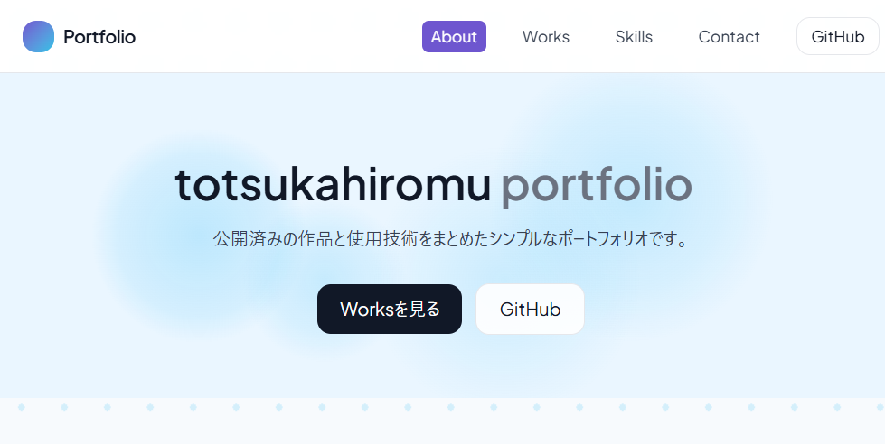

# 🪄 Totsuka Hiromu Portfolio



## 📝 概要
このサイトは、戸塚啓夢（Totsuka Hiromu）が制作した  
**個人ポートフォリオサイト** です。  

これまでに開発した Web アプリ・ツール・ゲームなどをまとめ、  
GitHub と Vercel を利用してホスティング・自動デプロイしています。  

---

## 🧑‍💻 使用技術
- **フレームワーク**: React + Vite  
- **スタイル**: Tailwind CSS  
- **アニメーション**: Framer Motion  
- **UI コンポーネント**: Shadcn UI / Lucide Icons  
- **ホスティング**: Vercel  
- **バージョン管理**: Git / GitHub

---

## 🚀 主な機能
- セクションごとのスクロール連動ナビゲーション
- レスポンシブデザイン（PC / スマホ両対応）
- 作品のジャンル・技術・年代によるフィルタリング
- 画像キャプション対応のモーダルギャラリー
- GitHub と Vercel による自動デプロイ

---

## 🖼️ 掲載作品のジャンル
- Unity ゲーム
- Python ツール
- Web アプリ / Web サイト
- このポートフォリオ自体（本サイト）

---

## 🛠️ 開発環境
```bash
# 依存関係インストール
npm install

# 開発サーバー起動
npm run dev

# ビルド
npm run build
